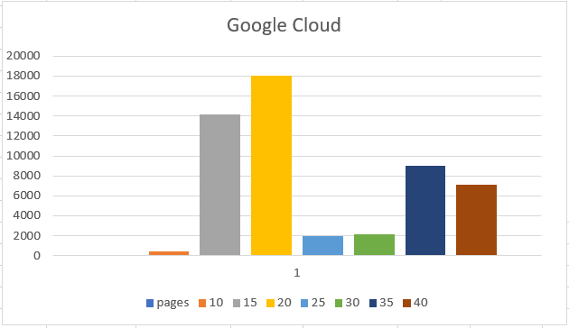

# Scalable Microservices to Label yelp images using Kuberenets :hand: sp18-616-02

| Keerthi Naredla
| knaredla@iu.edu
| Indiana University Bloomington
| hid: sp18-616-02
| github: [:cloud:](https://github.com/cloudmesh-community/hid-sp18-602/edit/master/project-report/report.md)
| code: [:cloud:] (https://github.com/cloudmesh-community/hid-sp18-602/tree/master/project-code)

---

Keywords: docker, vision, kubernetes, yelp, kafka

---
## Abstarct 
Automated Machine Learning is the emerging technology now from startups to major tech firms. The first most popularly used in the era of AutoML is Google Cloud AutoML which has suit of products including Vision, NLP, Speech, Translation and so on. Again in each of these products emphasis is made on important feature set, for instance in Cloud Vision there This project is an application of  Cloud Vision Api to label images from yelp dataset. The project is built in microservices architecture and deployed using kubernetes. The message broker Kafka is used to communicate between the microservices. This paper briefly discusses the technologies used for the implemenation of the project, the project setup, results and deployment benchmarks.

## Introduction

The applications are growing complex, not just functionality wise but
also the data generated and used are highly increasing. This makes it
absolute necessary to break down such complex application, instead of a
monolithic application so that product deployed is much more
maintainable, scalable, reliable, independent of failure of other
functional components of the application,portable, easy to deploy on
different cloud platforms, and so on. Most of these suit of best
practices called "Twelve-Factor Apps" can be bought into production of
Software applications using technologies such Docker, Kubernetes and
Microservice architecture [@hid-sp18-602-twelve-factor]. In this
project, an application is built using a combination of these three
technologies. In the below subsections, these concepts are briefly
introduced to better understand the working of the application.


## Implementation

### Yelp Dataset

Yelp provides an open-source dataset for the challenge with students and
university grads. The yelp data set is huge of nearly 2.66 gigabytes of
dataset comprised of all the text details present in yelp, this may
include all kinds of business and theri details. Apart from this, yelp
also holds photos dataset which is 7.50 gigabytes of compressed dataset,
which are purely images of count nearly 200,000, for purposes like image
analysis, apply machine learning and computer vision technologies. The
text-based dataset is usually in JSON/ CSV, SQL format that can be
downloaded from their website. In addition to this Yelp also gives
access to their data through Yelp-Fusion. 

#### Yelp Fusion API

On Yelp Developers blog different open source tools that leverage access to retrieve,test,implement on yelp dataset.
Yelp Fusion is a REST API, which can be integrated simply by generating and importing API token key into your program. This gives access to a variety of feature data such as business, locations,reviews, images,metadata and also a sepecific search url available to query on each of these features. This is very efficient on fetching data on fly with out additional storage disk space and based on your requirements steps like data scraping,cleaning, pre-processing can also be skipped. But the number of time data fetch is limited, if the data set is changes or some part of it is removed then it might affect your analysis. However, using Yelp Fusion REST API is easy and feasible with minimal system requirements, and on average no or very less downtime[@hid-sp18-602-yelp].

### Cloud Vision API

Cloud Vision API is the most popular API that Google has till date. It
is very easy and efficient to analyze the content of the image, which
has state-of-the art tools for Image detecting features like: face,
text, label and document text,web detection. It is further made easy to
use, through Cloud AutoML suite. Using Vision AutoML, it is just one
click away to upload images and run pre-determined, custom machine
learning models. It is built based on Google's powerful technology of
learning-to learn, neural network architecture. In fact, building custom
ML model is just few steps [@hid-sp18-602-cloud-automl]. First,
uploading training dataset with images labeled into google bucket or
human-support to label images and the ML model is trained according to
the provided dataset. And then test data is passed, and accuracy of
prediction, classification of test data set is determined. However, this
feature of Cloud AutoML is accessible to only limited customers, but the
basic feature of labeling the images such as data in Google is quite
possible through REST API and are available to use in different
programming languages [@hid-sp18-602-cloud-vision].

### Docker

Modern applications are often built using different technologies with
different versions based on the application requirement. Deploying many
such application on a single Operating System could be a huge risk at
times especially when there is a conflict in dependencies between
applications. For instance, if you consider installing 2 versions of
Nginx on the same OS, there would be a conflict with the namespace,
network port making it logically cumbersome to install same soaftware
with 2 different versions. Although the concept of containerization is
old, the ability to package applications with their dependencies into
the container, making applications independent and isolated from other
applications is huge progress to deploy applications, this is achieved
with Docker container technology. Morover,it is very easy to run
multiple containers using Docker. The docker image which is a snapshot
of the container is the basis to build a container. The Docker container
image is a packaging format that contains all the dependencies necessary
for the application along with required intial steps such a swtting
environment variables, or even running command to start the application.
These images are hosted on public or private repository such as
docker.hub, google storage. There are 2 ways to build a docker image,
first is to build Dockerfile, and the second way is make changes on
previous docker image. In most cases, a Dockerfile is built on a base
image that is useful for the application and then all the required
dependecies,commnads are added. Once the docker image is ready it takes
simple commands to build the container,push the final docker image to
the storage repository, and pull the docker image whenever required.
Thus, it is easy and robust to create, distribute and run applications
using Docker Containers with docker images and docker command-line
tools. There are less or no restrictions for docker usage, as containers
can be built on any machine with Docker installed it is highly in use by
DevOps [@hid-sp18-602-docker].

### Kubernetes

Although Docker makes it easy to deploy and run applications using
container technology when it comes to application configuration, service
discovery, managing updates, secrets management and monitoring
containers on the cluster, a better technology is required to leverage
all of these tasks. Here comes Kubernetes, an open-source platform that
provides a high level of abstraction and orchestration of containers
deployed on one or more clusters, which in turn are treated as a single
logical machine. Usually, a cluster has single Kubernetes master nodes
that keep on running despite explicitly deleting, and zero or more
worker nodes [@hid-sp18-602-kubernetes]. The master node is responsible
for managing the cluster, whereas the worker nodes work like a VM, it
consists of one or more pods, Volume, network ID and tools to handle
container operations.

A pod is the smallest unit of Kubernetes and it consists of one or more
containers. All the containers in the pod have shared the same
filesystem and IP address, this makes the communication between
containers in a pod easy. Each of these pods created based on the scheme
which is usually in YAML or JSON file format. The scheme covers
important aspects of spec which specifies the Pod behavior, container
name, container ports. A pod without Services or Replication Controller
cannot be accessed by the external client, neither scaling and
distribution of the application are possible  [@hid-sp18-602-pods].

Services provide an external interface for one or more pods. The Service
schema definition has 3 important parameters: kind, metadata, and spec.
The kind is set to Service to indicate a Kubernetes Service, which is
deployment, pod in case of Kubernetes deployment, pod definition files.
The label app and the name constitute the metadata. The spec mapping
includes a ports mapping for port 80 with name HTTP. The selector is the
key mapping in the spec and specifies a mapping to be used for selecting
the Pods to expose via the Service. Therefore, the service diverts the
network traffic to all its pods with the same label as the label
selector specified in the Service spec, in a round-robin manner. There
are 3 different types of Service: Load Balancer, Internal IP, Node port.
If a Service type is ClusterIP, then the service is accessible only
within the cluster via its internal port. Whereas if the service type is
Node port then the service is accessible from outside the node port,
which further routes the traffic to internal port Cluster IP of the
service, that is automatically created. Similarly Load Balancer service
type also automatically creates Node port and cluster IP. It gives
access for the external user to ping the IP. In addition to this Load
Balancer has the responsibility to balance the load between all the Pods
in Service [@hid-sp18-602-services].

Another important aspect in scaling applications is Replication
Controller, which manages the replication level of Pods by setting
"replicas" in Replication Controller definition or on the command line
with the --replicas parameter. This ensures that number of Pod replicas
are running at any given time. If a replica fails or is stopped
deliberately a new replica is started automatically. With these 2
crucial features scaling and replication factor, Kubernetes keep
microservices up and running all the time. Hence, Kubernetes is
production-ready, which provides dynamic container cluster orchestration
in real time.

Kubernetes as a cluster manager provides the feasibility for deploying
Microservices by breaking an application into smaller, manageable,
scalable components that could be used by groups with different
requirements; Fault-tolerant cluster in which if a single Pod replica
fails (due to node failure,for example), another is started
automatically; Horizontal scaling in which additional or fewer replicas
of a Pod could be run by just modifying the replicas label in the
Replication Controller or using the replicas parameter in the kubectl
scale command;

### Apache Kafka

Apache Kafka is a open source, real-time distributed streaming platform. It originally started as a research project at LinkedIn and later launched as open-source project with wide-range of active contributors. There are three main use cases for Kafka such as publish ,subscribe to topics od data to receive and send,  kafka stremas API used for microservices that require real-time continuous flow of records, Kafka as a Storage system can used for multiple puposes especially logging across distirbuted systems would be a good implementation. Deploying Apache Kafka on kubernets has recently evolved and there is lot of scope for scalbility and high availability with kubernetes. Further, Kafka has to connected with Zookeeper service discovery concept and it is must that Zookeeper is up and running for Kafka to work as expected. And this has further benfits, as Zookeeper can be used for other microservices for thier own puposes like service discovery, logging and so on.


## Design

The main aim of the application is to label photos from Yelp dataset
retrieved on passing location and search term such as food, dinner,
using cloud vision API. The application is divided into 3 microservices
frontend, backend, and mainapp. Each of these functionalities is
explained below along with intial setup.

### Initial Setup

As mentioned above,the application requires 2 important API Cloud Vision
API and Pub/Sub API, which have to enabled for the specific project id,
the application can be started, in google cloud console. The best part
for a software developer to test the working application is to launch
directly using gcloud command-line tool, as it doesn't require
authentication setup. For Cloud SDK installed on the local environment,
setting up the authentication is crucial. For this, it is first required
to create a service account and download service account key which is
usually in JSON file format. Then set the environment variable
`GOOGLE_APPLICATION_CREDENTIALS = [PATH]`, where `PATH` is the file path
of the JSON file downloaded from Google Console Dashboard.

After setting the environment variable, it is important to activate
gcloud command line tool, with the command "gcloud init". Then it is
required to setup the cluster to run he project. The cluster is built on
Google Cloud, for billing is activated on your Service Account. To setup
the cluster, it is required to choose the compute zone. The command
"gcloud config set compute/zone \<zone-name\>" sets up the particular
zone you would want your cluster to locate at.This is important becuase
it provides less latency when connecting to the cluster from gcloud,or
via Cloud SDK. The zone-name would like east1-b,central1-a and so on,
and it is better to choose according to location, although the features
offered doesn't differ much. The actual cluster can be created using the
command "gcloud container cluster create \<cluster-name\> --num-nodes
\<num\> --scope cloud-platform". This command specifies cluster name and
the number of nodes created for each zone of that cluster. After
creating a cluster, the cluster should be authorized with the service
account, in order to get access to all the api's. Hence the command "
gcloud container clusters get-credentials \<cluster-name\>". If the
cluster is perfectly created then you should be able to get the correct
information for the cluster created by activating "kubectl
cluster-info". Since initially, there are eno pods, services,
deployments created on running the command kubectl get pods you find no
pods created. The execution section give more details on how to run the
project.

### Frontend Microservices

The frontend of the application plays a key role as the load balancer
service for the entire application. It is basically a dynamic web-page,
which allows the user to enter location, for example, San Francisco, CA
and term like food, dinner. Based on these inputs, photos are fetched.
The technologies used for the web-page along is python, html,javascript
and css. The below paragraph explains breify about each of these
technologies and how they have been used in te frontend of this
application.

-   **Python** Python web-development framework Flask is used to make
    server calls to storage.py. The flask is an opensource tool which is
    an easy to use tool for server-side scripting. It can be installed
    using pip install flask command and imported in python via Flask
    package. Because it is a micro framework it can be implemented on
    top of any backend service with no restrictions like particular
    tools,libraries, or extensions are required. Moreover, Flask
    supports RESTful requests for dispatching GET,POST. Hence it is very
    useful in our project to easily make use of API to communicate and
    recivie from backend.

-   **Javascript** JavaScript is a core-technology mainly used to build
    dynamic web-pages. There are different framworks such vue.js,
    AngularJS,ReactJS, to design creative and interactive web pages. In
    this frontend javascipt is extended via a material design file in
    storage.googleapis.com. This really reduces the time, effort and
    gives world-class view for the webpage.

-   **HTML** HTML Hypertext Markup Language is useful to add content to
    the webpage. To make the webpages dynamic and add style to the
    page,Javascript, CSS are used. The HTML is the base of the webpage
    no matter any web-technologies out there, they must be added on top
    of HTML base page.

-   **CSS**

    Cascading Style Sheets (CSS) is used for styling the HTML webpage,
    with respect to display and it is added either internal with
    \<style\>\</style\> tags or external using CSS file. The CSS for
    this project is taken from google style package,googleapis for
    fonts, material icons and for other design can be selectively picked
    from material designs stored at google storage.

In this frontend, the main.py imports flask and it is the main program
that connect the frontend and server calls to the storage.py where
StrictRedis of REdis is imported and labels, respective imageurl stored
are retrieved. The received data from storage,py are then passed on the
web page via `render_template()`, this will send the the html page to
view and also passes the data required. There are 2 views enabled in the
webpage. The intial view consists of 2 input text box for user to enter
location and category. This information is routed to `get_yelp_images()`
function in mainapp via pubsub client. This enables the whole process of
extracting photos of the top 10 business from the search results based
on the location and term and then store their urls with annotations
detected using vision api, in redis storage. After that process ends and
the redis storage now has the relevant data, the 2nd view is activated
with the labels and images as the storage.py functions in the forntend
responds. Thus each of the services are very much linked to the frontend
service, it is like the start and endpoint of the project. Once the
images with labels are loaded, how many ever times you refresh you don't
see a change in the display because the data retrievd via storage.py
doesn't change. As the frontend service is deployed as a load-balancer
service an external IP is provided which enables user to access outside
of the cluster through a web-browser.

### Backend Microservice

The backend of the application is the storage service through Redis
which is important for storage of images and their respective labels
determined using Cloud Vision API [@hid-sp18-602-redis]. The redis is
accessible through redis image specified in backend.yaml file. The data
is stored into redis instance via Mainapp and retrieved in frontend in
order to populate the page with resulting images-label pair.

### Mainapp Microservice

The mainapp provides the actual functionality of the application,
starting from scraping the data to generating the desired output. The
major functionalities involved in the service is divided into
main.py,`yelp_label.py` and vision.py. Each is further
modularized with function, which are briefly explained in below
paragraphs.

The `yelp_images.py` has 4 functions `query_api()`, `get_business()`,
`search()` and `request()`; As the given location and term are passed to
`query_api`, it sends the information to search function. The search
function sends a GET request (GET
https://api.yelp.com/v3/businesses/search) with parameters term,location
and search limit equal to 10 in the json object. The JSON object
response for the GET request is a dictonary type and is returned to
calling function. The `query_api()` stores each buisness list into
businesses dictonary. This business ist consist of several other
parameter like rating, price, id, categories, location details,
reviewcount and so on. But yelp-fusion offers an exclusive option to get
more details of each business via GET Request (GET
https://api.yelp.com/v3/businesses/id) with business id. Therefore, for
each business, business id is extracted and passed to `get_business`. In
this function, request is sent with business path
https://api.yelp.com/v3/businesses/ and business id is appended to form
the appropriate url for the request. The response object for this
request consists of details specific to that business only, which
includes open hours, photos and reviews. For this project, we require
only photos of each business, hence the urls of the photos for all the
businesses are appended to a list. All the photos are returned to the
calling function in main.py.

In vision.py, the authorization to access Vision api is set through
Google Credentials python package. The authorization done at this step
isn't specific to vision api rather it is common to access almost any
Google API. Now, for image passed to the `detect_labels()`, a post
request is sent to Vision API to annotate the image, by particular
mentioning the label detection feature and the the image url for that
image. It is important to specify the feature, or any further details of
the image as it imporves Machine Learning model for the analysis of the
photo by adding weightage to each of the parameters. Along with the
label which is a description parameter of string type, response object
consists of details of the image such as score, confidence, location,
and so on. The label annotation is return to the calling function for
the sent image url.


To summarize, main.py brings together all the above functionalities, it
retrieves the data from `yelp_images.py`, passes photos to vision.py to
label each one of them and stores using storage.py.

## Results

{#fig:yelp_images_labeled}
```
+@fig:yelp_images_labeled is the result of this project when user 
provided input of business=food and location=Indianapolis

{#fig:yelp_images_labeled}
```

The results of the project is to display labeled images from Yelp photos
dataset. And this ahiecved by populating the browser with the label and
imageurl pair received by kafka consumer on topic labels. As the cloud-vision api is a
pre-trained model on huge dataset of Google, the label detection is
with on average measure of 0.8161305 score, and 0.8161305 topicality.
For this application, images of top 10
business for user input business category and location are generated and the image.annotate
request is reiterated for 3 times to make sure highly accurate label
is detected for the image, if not in a single request.

## Benchmark 

{#fig:google_cloud_log}
{#fig:aws_log}
{#fig:google_cloud_stat}
{#fig:aws_stat}
Deploying the application is made easy with the use of Docker and
Kubernetes. The Makefile and Docker file included installs all the
necessary dependecies to creating pods,services and deployments. This
takes atleast turnaround time of one minute on average to generate the external IP address.The runtime
analysis of the application, depends on the dataset volume for the given
input, as a result it takes throughput of for the label-detection and
showcasing the results on the browser. The benchmark for this project
extensively depends on Cloud Vision API as the bath processing for the images
is limited. The application is deployed on two major cloud platforms Google Cloud and AWS. The throughput is calculated using the timestamp log. The below comparision graphs is generated based on logs, kuberenets dashboard.


## Conclusion

Thus application to scrape data from yelp-fust thion API and detect
label using Cloud Vision api, which is neatly displayed on a browser
with the support of redis storage technology, follows MVC architecture
workflow which important dier in application deployment. With Kubernetes
not just orchestration of docker components but the flexibility,
scalability for the deployment of microservices is highly achieved.

## Acknowledgement

The authors would like to thank Dr.Gregor von Laszewski for his support
and suggestions to write this paper.

